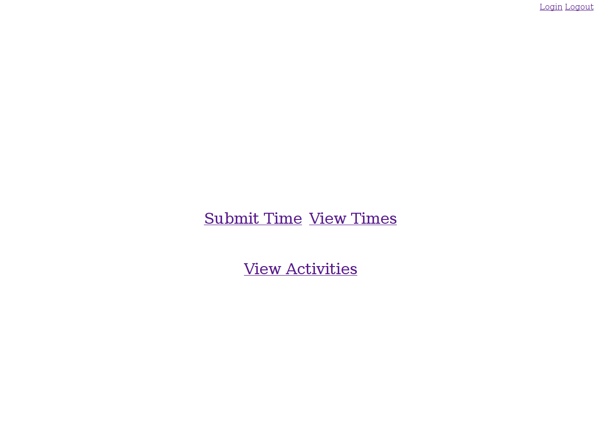
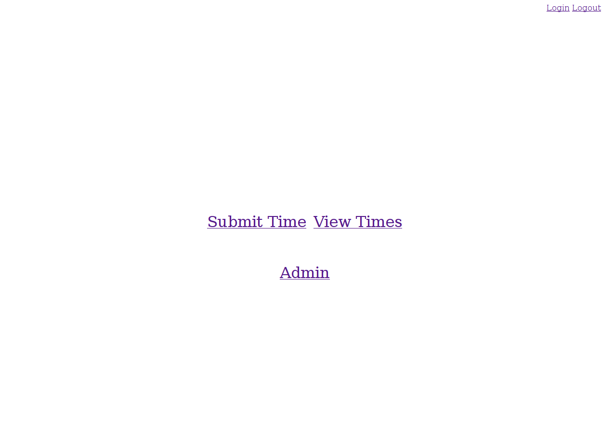
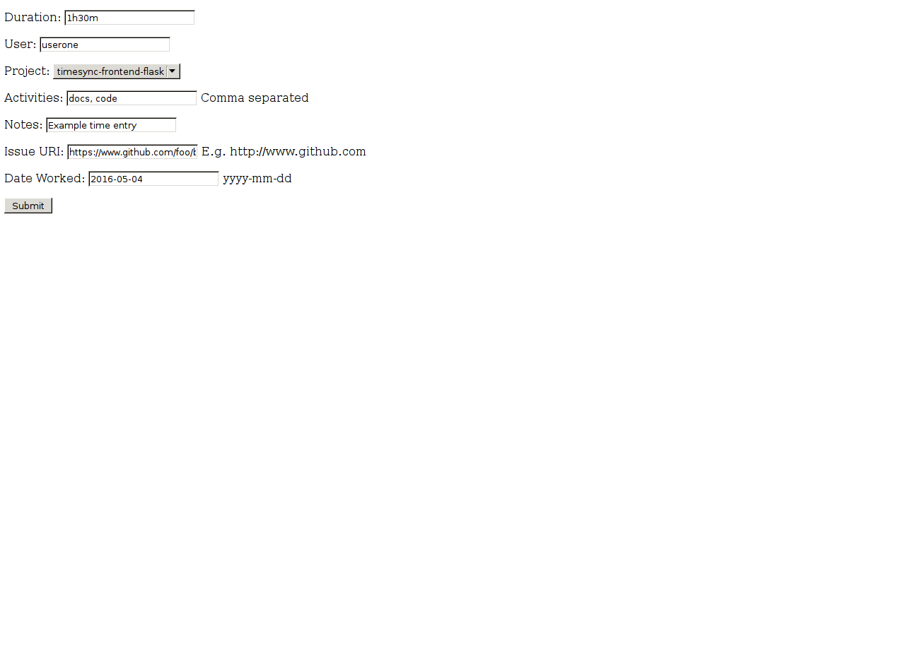
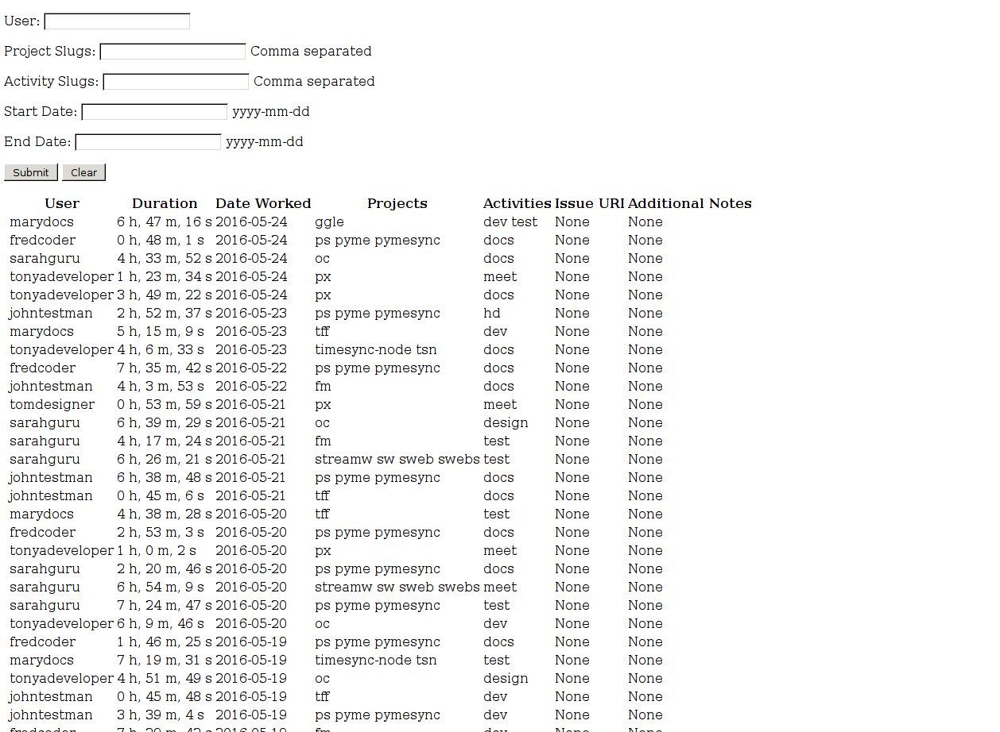
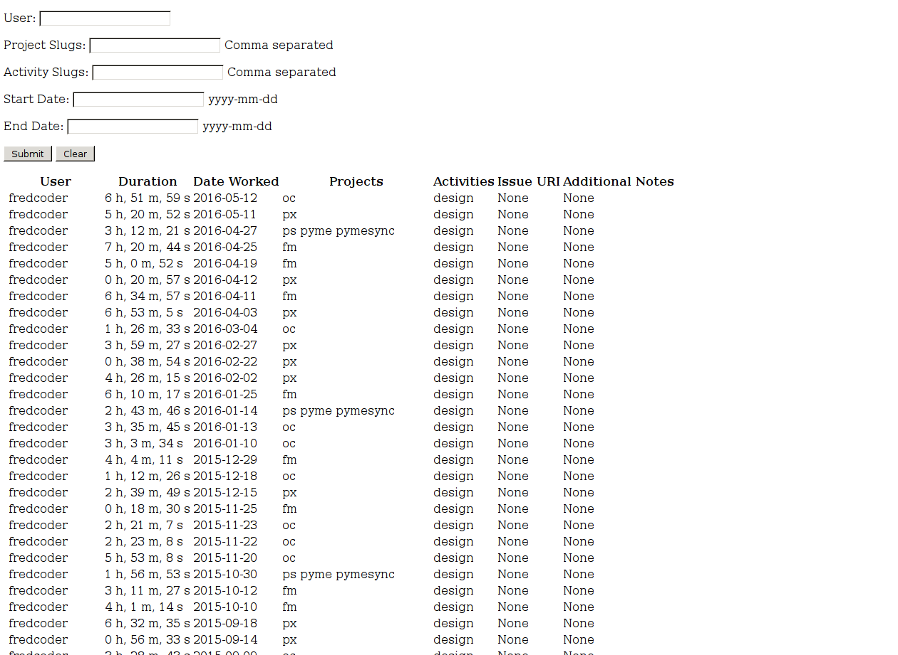
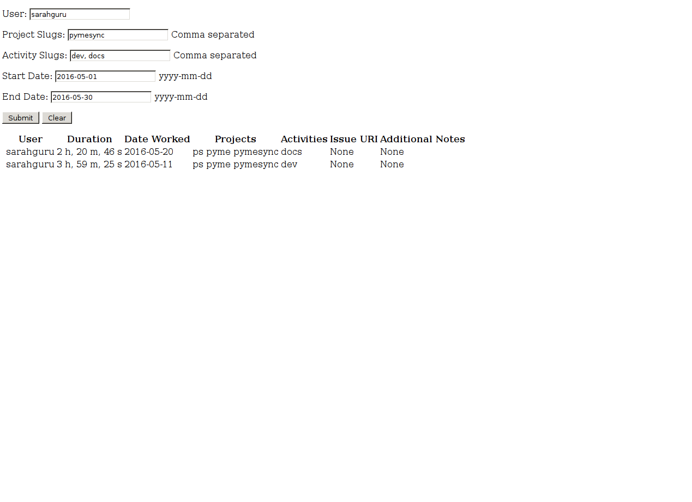
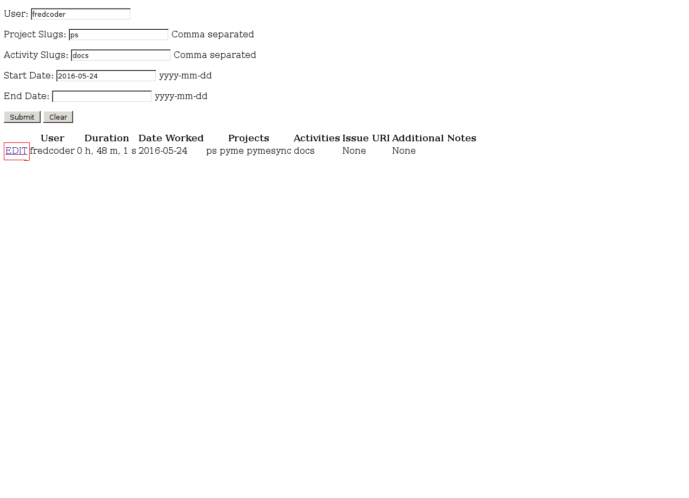
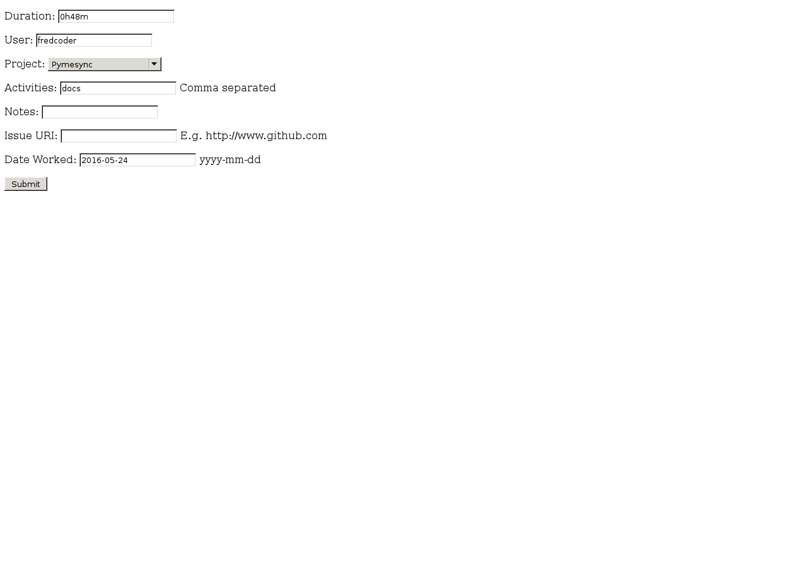
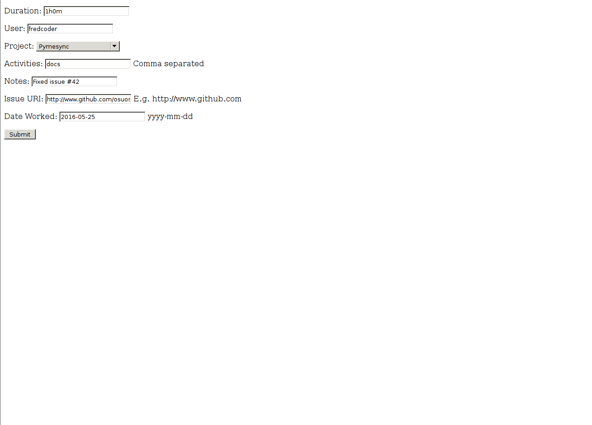

.. _usage:

.. role:: underline
    :class: underline

How to Use Timesync-Frontend-Flask
==================================

This page contains documentation on how to use timesync-frontend-flask as
both a normal user and administrator. For documentation on how to install and
configure the application, go to the `install`_ page.

.. _install: install.html

Navigating the Application
--------------------------

After you've entered the URL into your web browser and loaded the page, you
have to log in before you can do anything. To log in, click the link at the
top right of the page and enter your username and password into the form.
Once you've logged in as a non-admin user, you should see a page that looks
like this:

If you're an admin, the page should instead look like this:

Using the links at the top right corner of the page you can log out or log
in as another user. The links in the center of the page are used to view and
interact with TimeSync objects such as times and projects.

Submitting a Time
-----------------

To submit a time, click on :underline:`Submit Time`. After you're finished
filling out the form, hit "Submit" to submit the time to TimeSync.

=========== ========================================================= =========
Field Name                         Description                        Optional?
=========== ========================================================= =========
Duration    The length of the time entry. Entered in the format       **No**
            <hours>h<minutes>m
User        The user that the submitted time belongs to               **No**
Project     The project that the submitted time belongs to            **No**
Activities  A comma-separated list of activities that the submitted   **Yes**
            time belongs to
Notes       Other information about the submitted time                **Yes**
Issue URI   The URI of the issue that was worked on during this time  **Yes**
            entry
Date Worked The date that this time entry was worked on               **No**
=========== ========================================================= =========

Viewing Submitted Times
-----------------------

To view all the times that have been submitted, go to the index page and click
on :underline:`View Times`. On this page you can view time entries that have
been submitted to the TimeSync server.

You can sort times by fields other than by the default sorting (by date). To
sort times, click on the table header of the column that you wish to sort by.
To sort in the opposite direction (i.e. Z-A instead of A-Z), click on the table
header once more. For example, you could choose to sort the times by the name
of the users that submitted them. After clicking on the **User** text, the
page might look like this:

You can also filter times by different fields such as by user and by date

============== ===============================================================
  Field Name                              Description
============== ===============================================================
User           Filter time entries by username
Project Slugs  Filter time entries by project worked on (Entered as a list of
               values separated by commas)
Activity Slugs Filter time entries by activity worked on (Entered as a list of
               value separated by commas)
Start Date     Filter times beginning on a date (Entered in ISO date format)
End Date       Filter times ending on a date (Entered in ISO date format)
============== ===============================================================

Editing Times
-------------

In order to edit a time you must either be the user that submitted the time
or you must be a site admin. To edit a time, find it on the View Times
page then click the :underline:`EDIT` link next to the entry.

You'll be taken to a page similar to the Submit Time page but with the form
that has already been partially filled in with the the time entry's current data.

After you're done editing the time entry, click "Submit" to submit your
changes.
